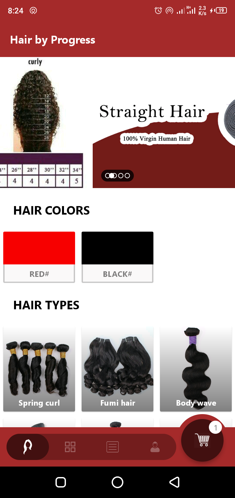
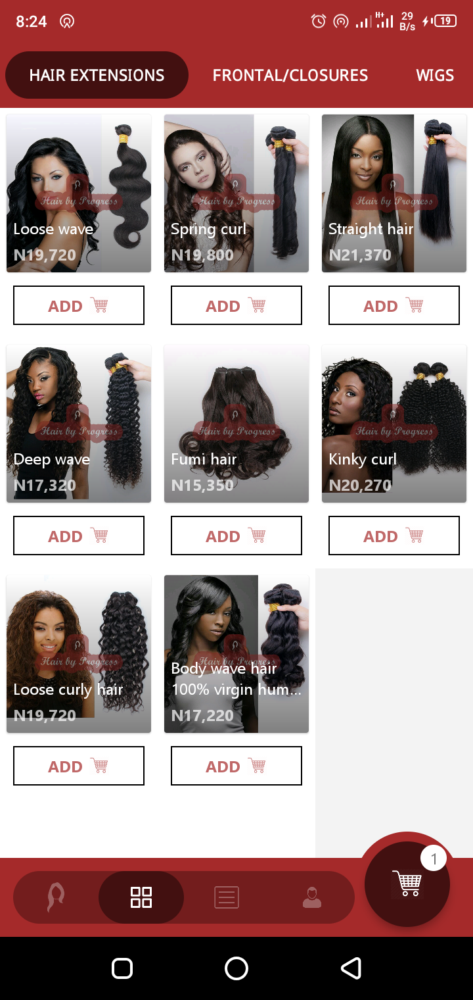
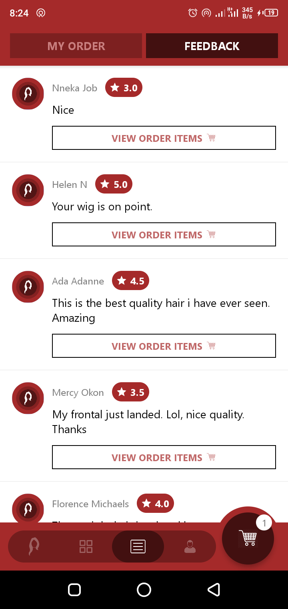
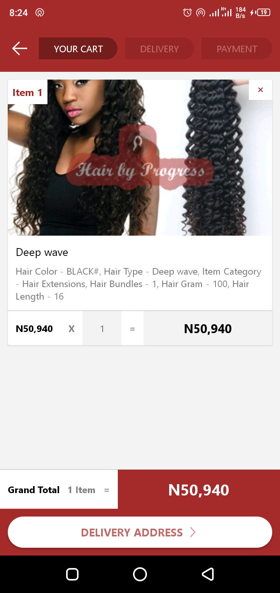
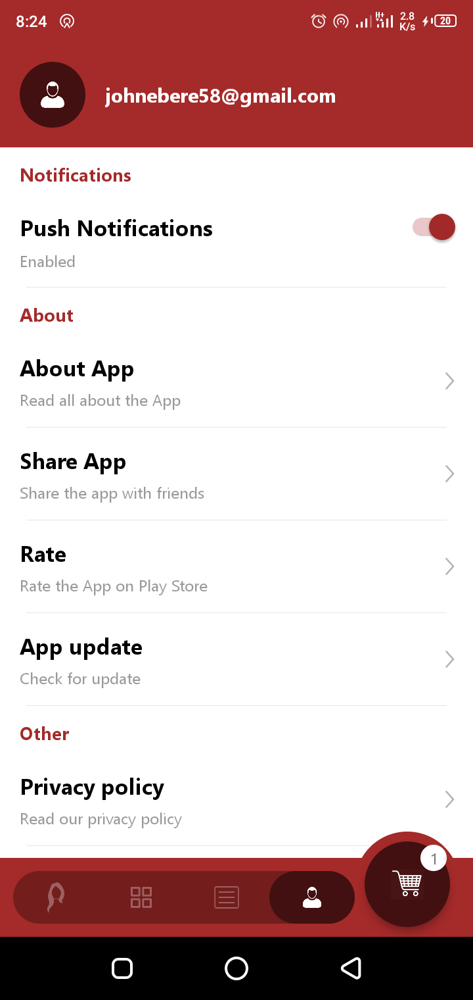

# HairbyProgress

HairbyProgress is an e-commerce App highly flexible and bendable for selling hair extensions. Written in Java for Android devices.

This is the full source for code for the App "Hair by Progress" on Google Play Store https://play.google.com/store/apps/details?id=com.hairbyprogress

  

  

## How To Use

Clone repo directly

Dont forget to add Google Services json file to the /app directory.

### :heart: Found this project useful?

If you found this project useful, then please consider giving it a :star: on Github and sharing it with your friends via social media.

## Project Created & Maintained By

### John E. Okore

# Donate

> If you found this project helpful or you learned something from the source code and want to thank me, consider buying me a cup of :coffee:
>
> - [Ravepay](https://rave.flutterwave.com/donate/oumg0prh9wta)

